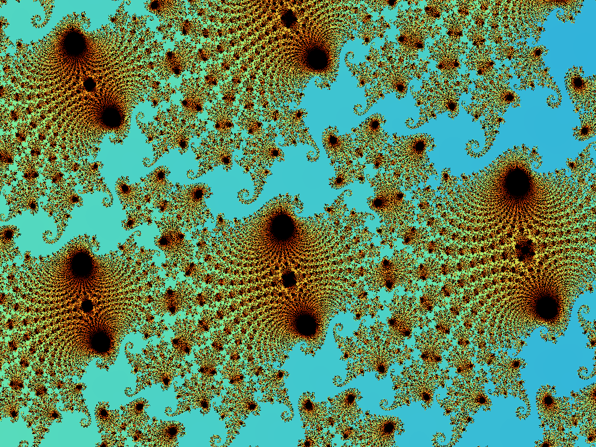
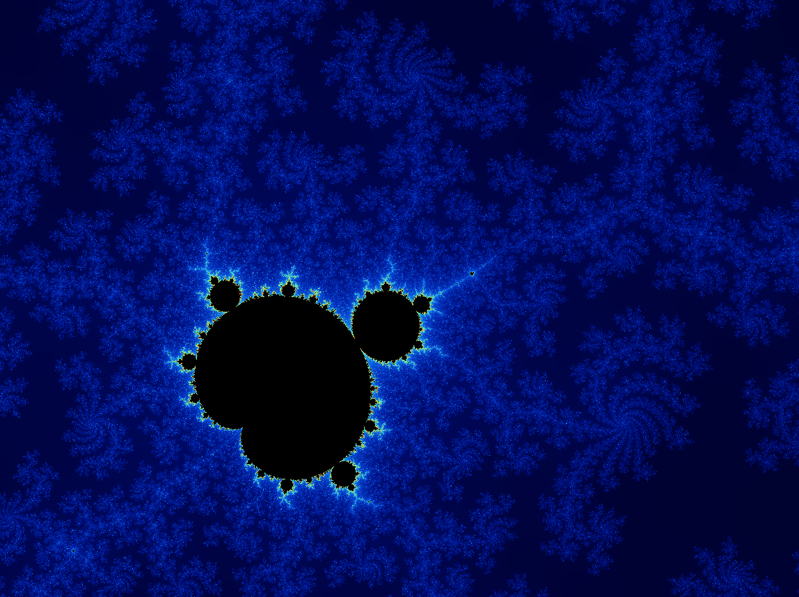

# Software implementation

## Cython
Initial versions of the code were written in Python and translated/compiled into Cython.

To install Cython (and if you already have `pip` installed), run below in the terminal:
```
pip install Cython
```

To compile Python files, make sure to `import cython` and save code in a `.pyx` format. Make a `setup.py` file (an example can be seen in the repo) and for the command step, run this line:
```
python setup.py build_ext --inplace
```

The Cythonized file can be run on a Python file that does `import <filename>` and `<filename>.count_increases(input_depths)`.


## C++
Alongside the Cython representation of the Mandelbrot set is a version written in C++ using SFML and multithreading.

To compile the code (first time):
```
g++ main.cpp Application.cpp MandelbrotSet.cpp -o mandelbrot -lsfml-graphics -lsfml-window -lsfml-system -pthread
```

To execute, just run `./mandelbrot` in the terminal. Zooming is done using the mouse, but for similarity to hardware should instead be implemented using a slider.

### Results
All were rendered with slightly different max iterations. Next: calculate the runtime and iterations dependency.



